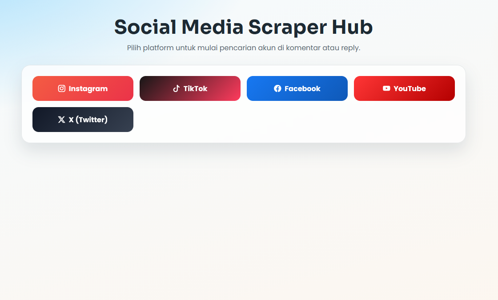
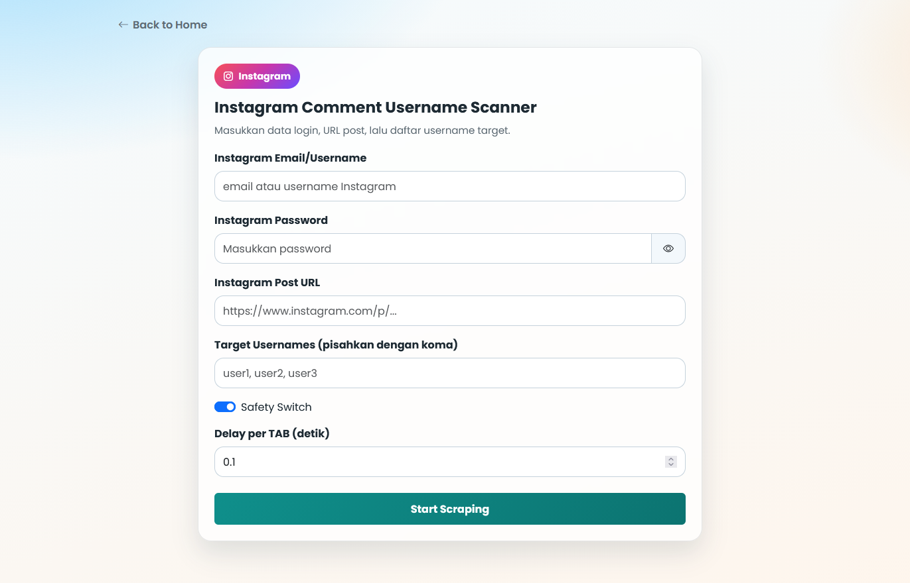
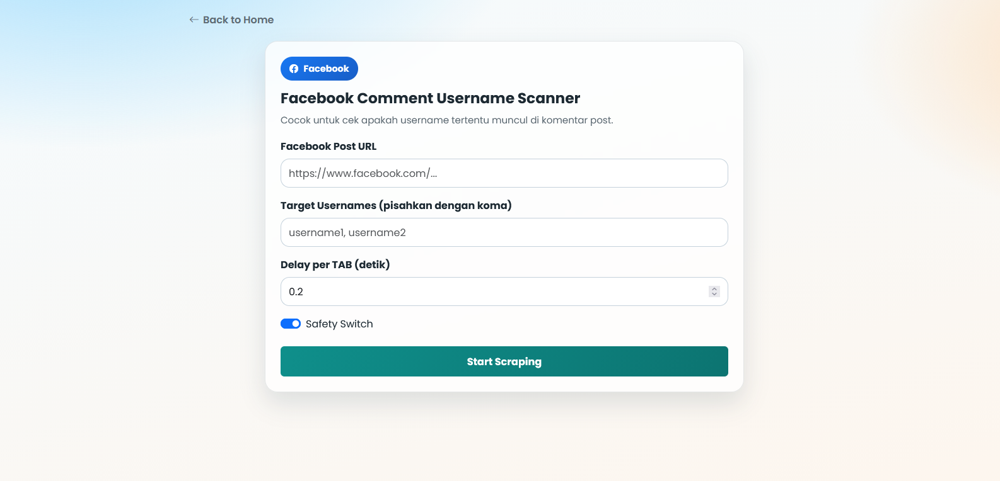
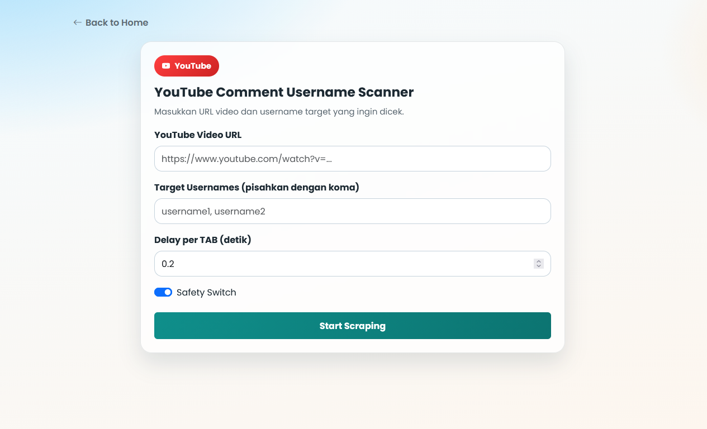
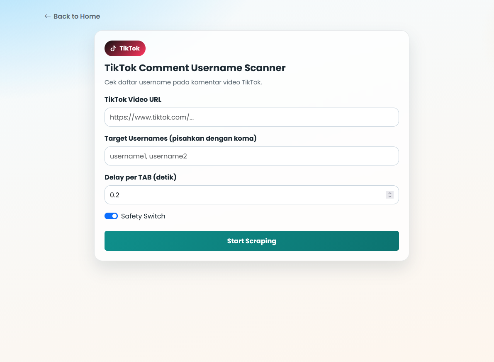
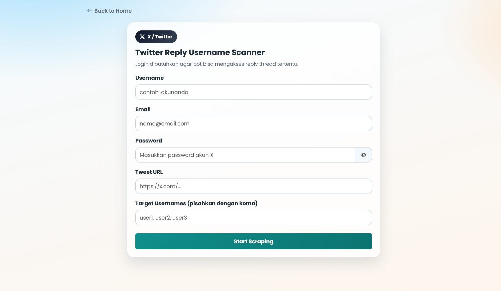

# Social Media Comment Username Scraper

## UI Screenshots

Below are example screenshots of the app interface for each platform:

<p align="center">
  <b>Home Page</b><br>
  
</p>

<p align="center">
  <b>Instagram Scraper</b><br>
  
</p>

<p align="center">
  <b>Facebook Scraper</b><br>
  
</p>

<p align="center">
  <b>YouTube Scraper</b><br>
  
</p>

<p align="center">
  <b>TikTok Scraper</b><br>
  
</p>

<p align="center">
  <b>X (Twitter) Scraper</b><br>
  
</p>

A Flask web app to search for specific usernames in comments or replies across multiple platforms:
- Instagram
- Facebook
- YouTube
- TikTok
- X (Twitter)

Each platform has its own input form. Results are displayed on a summary page, including screenshots when usernames are found.

## Features

- Consistent, lightweight, and responsive UI (desktop/mobile)
- Separate form page for each platform with basic input validation
- Unified result page showing Found/Not Found status
- Screenshot preview in a modal with zoom and pan
- Modular Flask structure using blueprints per platform

## Project Structure

- app.py: Main Flask entry point and routing
- instagram.py: Instagram scraping logic
- facebook.py: Facebook scraping logic
- youtube.py: YouTube scraping logic
- tiktok.py: TikTok scraping logic
- x.py: X (Twitter) scraping logic
- templates/: All HTML templates
- static/: Static files (CSS and scraping screenshots)
- chromedriver-win64/: Local chromedriver binary (optional to keep in repo)

## Requirements

- Python 3.10+ (recommended)
- Google Chrome installed
- Stable internet connection
- Windows (tested and developed on Windows)

## Installation

1. Clone or open this project folder.
2. Create a virtual environment:

```powershell
python -m venv .venv
```

3. Activate the virtual environment:

```powershell
.\.venv\Scripts\Activate.ps1
```

4. Install dependencies:

```powershell
pip install -r requirements.txt
```

## Running the App

```powershell
python app.py
```

The app will run at:
- http://127.0.0.1:5000

## Usage Flow

1. Open the Home page.
2. Choose a platform.
3. Fill in the form (content URL, target usernames, and credentials if required).
4. Click Start Scraping.
5. View results on the result page.

## Important Notes

- Some platforms require login and may change their UI, so Selenium selectors may need updates.
- Screenshots are saved to the static/ folder.
- Do not commit sensitive data (emails/passwords) to the repository.

## Uploading to GitHub

This project includes a .gitignore to prevent unnecessary files (Python cache, virtual env, screenshots, etc.) from being uploaded.

Quick steps:

```powershell
git init
git add .
git commit -m "Initial commit"
git branch -M main
git remote add origin <YOUR_GITHUB_REPO_URL>
git push -u origin main
```

## Troubleshooting

- If browser/driver fails to start:
  - Make sure your Chrome version is compatible.
  - Try updating packages:

```powershell
pip install -U selenium undetected-chromedriver
```

- If the target site changes layout:
  - You may need to update Selenium locators in the relevant platform file.

## Disclaimer

Use only for legal testing/analysis purposes and in accordance with each platform's Terms of Service.
